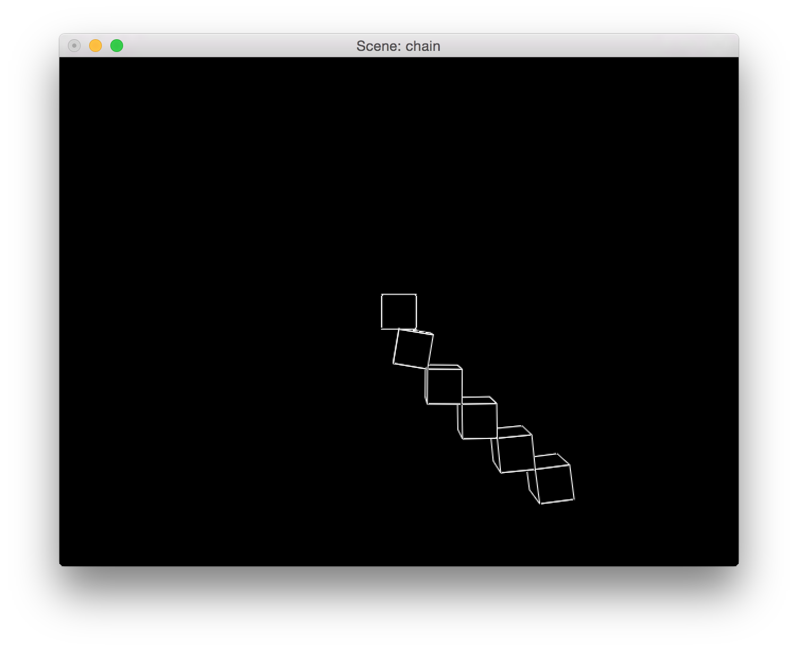

# hinges_py
*hinges_py* is a compact, minimal implementation of rigid-bodies with hinges, including rendering, in Python.

# Screenshot

# Command
 python hinges_py.py -scene chain -fancy

# Arguments
 - -scene: Chooses one of the built-in scenes: 'test', '1', 'shoulder', 'chain'.
 - -dt: Sets a fixed physics time step.
 - -adapt_fixed_dt: Tries to adapt the number of physics steps to run between render frame to make the simulation look time based.
 - -flex_dt: The physics time steps is adaptively set to the current frame rate.
 - -paused: Starts paused.
 - -length: Exits after the specified amount of seconds.
 - -baumg: Sets the Baumgarte stabilization factor.
 - -grav: A gravity multiplier.
 - -si_iters: The number of constraint block iterations.
 - -fancy: Hides occluded lines.
 - -h: Prints any command line arguments that the running code is querying. E.g: The shoulder scene has additional arguments that are too specific to document.

# Keyboard:
 - WASD, QE: Controls the camera.
 - R: Resets the camera.
 - Escape: Exits.

#  Notes:
 -  On Mac, the application starts minimized, with the glut 'rocket' icon.

# Dependencies
 - Python OpenGL
 - Numpy
